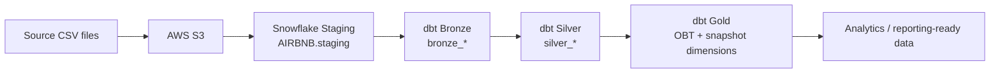

# AWS_DBT_Snowflake

This repository contains a personal dbt project that demonstrates a Snowflake-based data transformation workflow for Airbnb-style source data. The project models an end-to-end ELT pattern in which source CSV data is staged in Snowflake, then transformed through Bronze, Silver, and Gold layers using dbt. It includes incremental models, snapshot-based historical tracking, reusable macros, and data quality checks.

The repository is intentionally structured as a learning and portfolio project: it focuses on practical dbt implementation patterns, transformation logic, and data validation rather than a production-grade cloud platform deployment.

## 1. Project Overview

The project was created to exercise a realistic data engineering workflow using AWS S3, Snowflake, and dbt. Source files are treated as raw CSV data stored in S3 and then landed into Snowflake staging tables, where dbt builds a clean analytical model layer on top.

The implementation demonstrates several core data engineering skills:

- Data ingestion and staging patterns
- SQL-based transformation logic
- Layered modelling with Bronze, Silver, and Gold stages
- Incremental processing for efficient refreshes
- Historical tracking with dbt snapshots
- Data quality testing and validation
- Reusable dbt macros for common transformations
- Version control and reproducible project setup with Git and uv

## 2. Objectives / Requirements

The project is designed around the following requirements and capabilities:

- Ingest source CSV data into the data pipeline
- Store source data in AWS S3
- Set up Snowflake staging tables to receive the source data
- Load source data into Snowflake staging tables
- Transform raw data with dbt
- Separate transformations into Bronze, Silver, and Gold layers
- Implement incremental processing for large or frequently changing datasets
- Track historical changes using dbt snapshots
- Validate data quality using dbt tests and SQL assertions
- Create reusable transformation logic with dbt macros
- Maintain the project in Git/GitHub with a repeatable local environment

## 3. Architecture

The repository follows a layered data transformation architecture centred on Snowflake and dbt, with AWS S3 used as the source data landing location.

Source CSV files
↓
AWS S3
↓
Snowflake Staging
↓
dbt Bronze
↓
dbt Silver
↓
dbt Gold
↓
Analytics / reporting-ready data



### Component roles

- AWS S3: stores raw CSV source files used as the upstream landing area for the project.
- Snowflake: hosts the warehouse database and staging tables used by the pipeline (`AIRBNB` database, `staging` schema).
- dbt: performs the transformation logic, incremental load logic, testing, and snapshot-based historical tracking.
- Git/GitHub: manages version control and collaborative development for the project.
- Python / uv: provides the project environment and dependency management for dbt and Snowflake tooling.

## 4. Data Flow

The data flow in this project is straightforward and intentionally transparent:

1. The source CSV files are stored in AWS S3 as the project's raw data landing location.
2. The staged source tables in Snowflake are defined under `AIRBNB.staging` and mapped in `models/source/source.yml`:
   - `listings`
   - `bookings`
   - `hosts`
3. dbt Bronze models read directly from those staged source tables and preserve the raw structure for downstream use:
   - `bronze_listings.sql`
   - `bronze_bookings.sql`
   - `bronze_hosts.sql`
4. dbt Silver models apply business-friendly cleaning and derived logic:
   - `silver_listings.sql`
   - `silver_bookings.sql`
   - `silver_hosts.sql`
5. dbt Gold models build the analytical layer and join the cleaned data into a reporting-friendly model:
   - `obt.sql` creates an object-level analytical dataset by joining Silver booking, listing, and host information.
   - `ephemeral` models under `models/gold/ephemeral/` expose subsets of the Gold data for downstream use.
   - Snapshot tables in `snapshots/` record historical versions for `dim_hosts`, `dim_listings`, and `dim_bookings`.

## 5. Data Transformation Layers

### Bronze Layer

The Bronze layer is the first transformation stage and keeps the source data in a raw-table-like structure. The Bronze models simply select from staged Snowflake source tables and are configured to materialize as tables in the `bronze` schema.

Relevant models:

- `bronze_bookings.sql`
- `bronze_hosts.sql`
- `bronze_listings.sql`

The Bronze definitions are intentionally simple and focused on preserving raw source structure before downstream cleansing and enrichment.

### Silver Layer

The Silver layer adds business logic and data shaping. The SQL in this project shows several concrete transformations:

- `silver_bookings.sql`
  - Uses an incremental strategy keyed by `BOOKING_ID`
  - Selects the booking record from the Bronze table
  - Calculates `TOTAL_AMOUNT` as:
    `ROUND(NIGHTS_BOOKED * BOOKING_AMOUNT, 2) + CLEANING_FEE + SERVICE_FEE`
  - Uses the `multiply` macro to compute the booking amount subtotal and adds fee fields

- `silver_hosts.sql`
  - Uses an incremental strategy keyed by `HOST_ID`
  - Replaces spaces in `HOST_NAME` with underscores
  - Maps `RESPONSE_RATE` into quality categories:
    - `VERY GOOD` for > 95
    - `GOOD` for > 80
    - `FAIR` for > 60
    - `POOR` otherwise
  - Renames `CREATED_AT` to `HOST_CREATED_AT`

- `silver_listings.sql`
  - Uses an incremental strategy keyed by `LISTING_ID`
  - Converts `PRICE_PER_NIGHT` to integer via the `tag` macro pattern in the project
  - Adds a `PRICE_PER_NIGHT_TAG` output derived from the tag logic (`low`, `medium`, `high`)

### Gold Layer

The Gold layer is intended to support analytics and reporting by assembling a joined analytical model. The most important Gold model is `obt.sql`, which joins Silver-level bookings, listings, and hosts into a single object-level table.

The project also contains snapshot-based dimension tables:

- `snapshots/dim_hosts.yml`
- `snapshots/dim_listings.yml`
- `snapshots/dim_bookings.yml`

These are built from the Gold-level `hosts`, `listings`, and `bookings` ephemeral models and provide historical tracking by using `strategy: timestamp` with `updated_at` fields.

## 6. Incremental Processing

Incremental processing is implemented in several models using dbt's `is_incremental()` logic.

Examples:

- `silver_bookings.sql` uses `materialized='incremental'` with `unique_key='BOOKING_ID'`
- `silver_hosts.sql` uses `materialized='incremental'` with `unique_key='HOST_ID'`
- `silver_listings.sql` uses `materialized='incremental'` with `unique_key='LISTING_ID'`
- `bronze_bookings.sql`, `bronze_hosts.sql`, and `bronze_listings.sql` also use incremental logic based on `CREATED_AT`

The pattern used in the project is:

```sql

    WHERE CREATED_AT > (SELECT COALESCE(MAX(CREATED_AT), '1900-01-01') FROM {{ this }})

```

This allows the pipeline to only process newly updated or newly arrived rows instead of reloading the full table on each run. That is useful when working with growing source datasets where full refreshes are inefficient or unnecessary.

## 7. dbt Snapshots

The project includes dbt snapshots for historical tracking of key dimensions.

Files:

- `snapshots/dim_hosts.yml`
- `snapshots/dim_listings.yml`
- `snapshots/dim_bookings.yml`

Each snapshot uses the timestamp strategy and tracks changes based on an updated date column:

- `dim_hosts`: `HOST_CREATED_AT`
- `dim_listings`: `LISTING_CREATED_AT`
- `dim_bookings`: `CREATED_AT`

Configuration pattern:

```yaml
snapshots:
  - name: dim_hosts
    relation: ref('hosts')
    config:
      schema: gold
      database: AIRBNB
      unique_key: HOST_ID
      strategy: timestamp
      updated_at: HOST_CREATED_AT
      dbt_valid_to_current: "to_date('9999-12-31')"
```

These snapshots preserve the historical state of the dimension records so changes can be traced over time without overwriting the original version.

## 8. Data Quality & Testing

The project includes both generic dbt tests and custom SQL-based assertions.

### Generic dbt tests

`models/source/source.yml` and `models/bronze/bronze.yml` define data tests on source and Bronze-level columns, including:

- `not_null`
- `unique`
- `accepted_values`

Examples from the repository:

- `BOOKING_ID` is required and unique
- `LISTING_ID` is required
- `BOOKING_DATE` is required
- `BOOKING_STATUS` must be either `confirmed` or `cancelled`

These tests help maintain data integrity at the earliest stage of the pipeline.

### Custom SQL tests

The `tests/` directory contains several validation queries:

- `booking_amount_positive.sql`
  - Fails when `BOOKING_AMOUNT < 0`
  - Severity: `error`

- `booking_date_valid.sql`
  - Fails when `BOOKING_DATE > CURRENT_DATE()`
  - Severity: `error`

- `booking_amount_threshold.sql`
  - Warns when `BOOKING_AMOUNT < 200`
  - Severity: `warn`

- `total_amount_calculation.sql`
  - Compares the Silver-layer `TOTAL_AMOUNT` with the expected formula from the Bronze data
  - Ensures the derived calculation remains consistent with the source booking values

These tests provide both strict validation and warning-based business checks.

## 9. dbt Macros

The project includes a small set of reusable dbt macros in `macros/`.

- `multiply.sql`
  - Defines a reusable multiplication helper:
    `round({{x}} * {{y}}, {{precision}})`
  - Used in `silver_bookings.sql` to calculate `TOTAL_AMOUNT`.

- `tag.sql`
  - Defines a value classification macro:
    - `< 100` -> `low`
    - `< 200` -> `medium`
    - otherwise `high`
  - This is used to create `PRICE_PER_NIGHT_TAG` in the Silver listing transformation.

- `generate_schema_name.sql`
  - Customizes the target schema name logic and returns either the custom schema or the project default schema.

- `trimmer.sql`
  - Present in the codebase but appears unused in the active model logic.

These macros demonstrate common dbt reuse patterns for calculations, categorization, and schema naming.

## 10. Project Structure

```text
aws_dbt_snowflake_project/
├── analyses/
│   ├── explore.sql
│   └── test_investigation.sql
├── dbt_project.yml
├── logs/
├── macros/
│   ├── generate_schema_name.sql
│   ├── multiply.sql
│   ├── tag.sql
│   └── trimmer.sql
├── models/
│   ├── bronze/
│   │   ├── bronze_bookings.sql
│   │   ├── bronze_hosts.sql
│   │   └── bronze_listings.sql
│   ├── gold/
│   │   ├── ephemeral/
│   │   │   ├── bookings.sql
│   │   │   ├── hosts.sql
│   │   │   └── listings.sql
│   │   ├── fact.sql
│   │   └── obt.sql
│   ├── silver/
│   │   ├── silver_bookings.sql
│   │   ├── silver_hosts.sql
│   │   └── silver_listings.sql
│   └── source/
│       └── source.yml
├── seeds/
│   └── .gitkeep
├── snapshots/
│   ├── dim_bookings.yml
│   ├── dim_hosts.yml
│   ├── dim_listings.yml
├── target/
├── tests/
│   ├── booking_amount_positive.sql
│   ├── booking_amount_threshold.sql
│   ├── booking_date_valid.sql
│   └── total_amount_calculation.sql
├── .user.yml
├── profiles.yml
├── profiles.yml.example
└── README.md
```

Note: `target/` and `dbt_packages/` are generated local build artifacts and are not the primary source of the project logic.

## 11. Technologies Used

| Technology | Purpose |
| --- | --- |
| AWS S3 | Raw source data storage and staging input |
| Snowflake | Cloud data warehouse for staging and analytical data |
| dbt | Transformation, modelling, testing, snapshots, and documentation support |
| SQL | Core transformation and validation logic |
| Python / uv | Environment management and dependency reproducibility |
| Git / GitHub | Version control and repository management |

## 12. Setup & Execution

This project can be set up locally using uv and dbt.

### Prerequisites

- Python environment managed with uv
- Access to Snowflake credentials for the project target environment
- Local `profiles.yml` configured with the correct database, warehouse, and user settings

### Commands

```bash
cd AWS_DBT_Snowflake
uv sync
uv run dbt deps
uv run dbt debug
uv run dbt run
uv run dbt test
uv run dbt snapshot
```

The repository includes `profiles.yml.example`, which demonstrates the expected dbt profile pattern using environment variables for sensitive values. Copy this file to a local `profiles.yml` and set the required Snowflake parameters without committing the file to source control.

## 13. Security / Credentials

This project uses Snowflake credentials for local dbt execution. Credentials and sensitive configuration should never be committed to Git.

Best practice for this repository:

- Keep a local `profiles.yml` file outside the Git-tracked project folder or add it to `.gitignore`
- Use environment variables where possible, as shown in `profiles.yml.example`
- Avoid storing account names, passwords, usernames, or warehouse identifiers in source-controlled files

Never include actual credentials, passwords, access keys, or account identifiers in the repository or project documentation.

## 14. Key Learning Outcomes

This project demonstrates several practical data engineering and analytics engineering skills:

- Cloud-based source data ingestion patterns
- Snowflake warehouse usage
- SQL transformation and modelling
- dbt layering (Bronze/Silver/Gold)
- Incremental ETL/ELT processing
- Historical tracking with snapshots
- Data quality testing and validation
- Reusable transformation logic through macros
- Source and model governance basics
- Version control with Git/GitHub
- Reproducible development environments using Python and uv

## 15. Future Improvements

The following are realistic next-step improvements for the project, clearly identified as future work rather than current implementation status:

- Add CI/CD for dbt validation and automated testing
- Introduce orchestration for scheduled runs and ingestion workflows
- Expand the data quality framework with more business rules and source freshness checks
- Improve monitoring, alerting, and operational logging
- Add automated dbt documentation deployment
- Extend the analytical layer with more business-focused Gold models and dimensions
- Integrate a more complete ingestion pipeline from raw S3 sources into Snowflake

## Summary

This repository is a focused dbt and Snowflake project that demonstrates a practical data engineering workflow: source files are staged in AWS S3 and Snowflake, transformed through Bronze, Silver, and Gold layers, validated with tests, and tracked historically with dbt snapshots. It is well suited as a portfolio project and as source material for technical presentations on modern data transformation practices.
